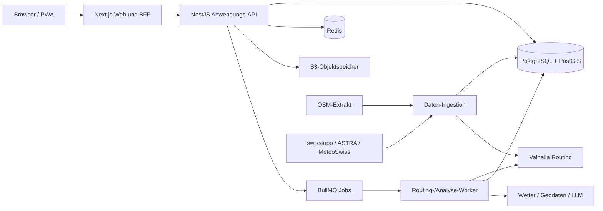

# Velvetia – technischer Umsetzungsplan

**Produkt:** Velvetia (Velo + Helvetia)  
**Planungsstand:** 15. August 2026  
**Initiale Zielregion:** Schweiz und grenznahes Ausland  
**Dokumentstatus:** Entscheidungsgrundlage; Kosten und externe Limits vor Beschaffung erneut prüfen

## 1. Executive Summary

Velvetia soll als **modularer Monolith mit separat betriebenem Routingdienst und asynchronen Workern** entstehen. Diese Architektur ist für ein Greenfield-Produkt schneller und betrieblich einfacher als Microservices, hält aber die fachlich volatilen Teile – Routing, externe Datenquellen, KI und Hintergrundberechnungen – über klare Ports austauschbar.

Die empfohlene technische Basis lautet:

- **Web:** Next.js, React, TypeScript, MapLibre GL JS, Tailwind CSS und eine zugängliche Headless-Komponentenbibliothek.
- **Anwendungs-API:** NestJS mit Fastify-Adapter, OpenAPI und Zod/JSON-Schema an den Systemgrenzen.
- **Persistenz:** PostgreSQL mit PostGIS; Redis für Cache, Rate Limits und BullMQ-Jobs; S3-kompatibler Objektspeicher für GPX- und Importartefakte.
- **Routing:** zunächst selbst betriebene Valhalla-Instanz auf einem regionalen OSM-Extrakt; GraphHopper und openrouteservice werden im Phase-0-Spike als Vergleichskandidaten praktisch vermessen.
- **Karte:** MapLibre GL JS; für den Prototyp offizielle geo.admin.ch-Vector-Tiles oder ein kommerzieller Tile-Dienst, später bei Bedarf eigener OpenMapTiles/PMTiles-Stack.
- **Höhe:** swissALTI3D für die Schweiz, mit grenzüberschreitendem Fallback; Höhenwerte werden vorverarbeitet und dem Routinggraph beziehungsweise einer Sampling-Pipeline zugeführt.
- **POI/Öffnungszeiten:** OSM-Extrakt in eigener PostGIS-Datenbank, nicht die öffentlichen Overpass-/Nominatim-Instanzen als Produktionsabhängigkeit.
- **Wetter:** MeteoSwiss Open Data als bevorzugte Schweizer Quelle; zunächst nur Anzeige und Warnung, erst nach Validierung Bestandteil der Optimierung.
- **KI:** serverseitige LLM-Anbindung mit strikt schema-validierter Ausgabe. Die KI übersetzt Sprache in Kriterien und erklärt Ergebnisse, berechnet aber niemals Wege oder Tatsachen.
- **Authentifizierung:** Auth.js mit E-Mail-Verifikation, sicheren Sessions und optionalen OAuth-Providern; Autorisierung bleibt in der eigenen API und Datenbank.
- **Betrieb:** containerisiert; Frontend optional auf Vercel, API/Worker/Valhalla/PostGIS zunächst auf EU- oder Schweizer Infrastruktur. Für Routing-Jobs kein rein serverloses Laufzeitmodell.

### MVP-Abgrenzung

Das MVP umfasst eine One-Way- und Rundtourenplanung für Rennrad, Gravel, Freizeit/Touring und Alltag/City in der Schweiz, einen Routenvorschlag, Kartenbearbeitung über Wegpunkte, Höhenprofil, Oberflächen-/Wegtyp-Auswertung, nachvollziehbare Warnungen, Speicherung und GPX-Export. Der Code kapselt Länderabdeckung und Datenquellen, damit später einzelne Länder, Europa oder weltweite Regionen ergänzt werden können. MTB, Wetteroptimierung, Versorgung mit belastbaren Öffnungszeiten, sprachbasierte Änderungen und Route Art folgen erst nach den jeweiligen Machbarkeitsspikes.

### Wichtigste Produktentscheidung

„Sicherheit“ wird nicht als einzelne objektive Zahl verkauft. Velvetia zeigt eine **Eignungs-/Risikoeinschätzung mit Gründen, Datenquellen, Datenalter und Konfidenz**. Fehlende Daten ergeben „unbekannt“, nicht automatisch „sicher“.

## 2. Ziele, Nichtziele und Erfolgsmessung

### 2.1 Ziele des Kernprodukts

1. Aus wenigen Angaben in unter 30 Sekunden einen brauchbaren Routenvorschlag erzeugen.
2. Rennrad- und Gravelprofile sichtbar unterschiedlich und nachvollziehbar routen.
3. Teilstrecken nach Kartenänderungen in der Regel unter 3 Sekunden neu berechnen.
4. Distanz, Zeit, Höhe, Steigung, Oberfläche und Wegtyp konsistent ausgeben.
5. Eine Route als valides, interoperables GPX 1.1 exportieren.
6. Jede Warnung und Empfehlung auf konkrete Segmentattribute zurückführen.
7. Externe Anbieter und Abdeckungsregionen ohne Änderungen am Domänenmodell austauschen können.

### 2.2 Nichtziele des MVP

- Live-Navigation und Ride-Tracking
- garantierte Sicherheit oder Echtzeit-Vollständigkeit
- globale Abdeckung
- MTB-Trailrouting
- automatische Wetteroptimierung
- verlässliche Öffnungszeiten für alle POIs
- Route Art
- Social Feed, Ranglisten oder Trainingsanalyse

### 2.3 Messbare Produkt-KPIs

- Anteil generierter Routen, die ohne harte Fehler exportierbar sind: **≥ 99 %**.
- Referenzrouten ohne unzulässigen Wegabschnitt: **≥ 98 %**, Rest mit sichtbarer Warnung.
- Distanzabweichung bei Rundtouren: Median **≤ 7 %**, P90 **≤ 15 %**.
- Antwortzeit One-Way P95: **≤ 5 s**; Rundtour P95: **≤ 20 s**.
- Teilneuberechnung P95: **≤ 3 s**.
- GPX-Import in mindestens Garmin Connect, Wahoo und Komoot-Testworkflow erfolgreich.
- Nutzertest: ≥ 80 % der Testpersonen erstellen ohne Hilfe eine Route und exportieren sie.

## 3. Architekturentscheidung

### 3.1 Zielarchitektur



### 3.2 Verantwortlichkeiten

| Komponente | Verantwortung | Nicht verantwortlich für |
|---|---|---|
| Next.js Web/BFF | UI, SSR, Formularzustand, Karteninteraktion, sichere Browser-Schnittstelle | Routinglogik, Quellenwahrheit |
| Anwendungs-API | AuthZ, Validierung, Domänenregeln, Versionierung, Jobsteuerung | Pfadsuche im Straßengraph |
| Routingdienst | Map Matching, Pfadsuche, Alternativen, Edge-Attribute | Nutzerkonten, Erklärtexte |
| Analyse-Worker | Höhen-/Segmentanalyse, Scoring, Rundtourkandidaten, GPX | UI-Zustand |
| Ingestion | OSM/OGD laden, normalisieren, Datenstände und Provenienz | synchrone Nutzeranfragen |
| LLM-Adapter | Sprache → Schema, Erklärungen aus belegten Fakten | Geodaten erfinden oder Pfade berechnen |

### 3.3 Warum modularer Monolith

Ein einzelnes deploybares API-Artefakt beschleunigt die frühe Entwicklung, hält Transaktionen einfach und vermeidet verteilte Fehlerbilder. Fachmodule (`identity`, `planning`, `routes`, `analysis`, `gpx`, `poi`, `weather`, `ai`, `catalog`) dürfen nur über definierte Application Services miteinander sprechen. Valhalla bleibt separat, weil es eigene Daten, Releases, CPU-/RAM-Profile und Skalierung besitzt. Worker laufen separat, weil Rundtourvarianten und Analyse nicht an HTTP-Laufzeiten gebunden sein sollen.

**Spätere Extraktionskandidaten:** Routing-Orchestrierung, Geodaten-Ingestion und Benachrichtigungen. Eine Extraktion erfolgt erst bei messbarem Skalierungs- oder Teamproblem.

### 3.4 Datenfluss einer Planung

1. Browser sendet validierte Kriterien und eine idempotente Request-ID.
2. API erzeugt `planning_job` und eine unveränderliche Eingabesnapshot-Version.
3. Worker normalisiert Orte, erzeugt Kandidaten und ruft Valhalla auf.
4. Kandidaten werden segmentiert, mit Höhe/OSM-Attributen angereichert und bewertet.
5. Nur belegte Fakten werden in eine `RouteExplanationInput`-Struktur geschrieben.
6. Ergebnisse werden als Route-Entwürfe persistiert; Fortschritt läuft über SSE.
7. Browser vergleicht Varianten; erst „Speichern“ erzeugt eine benannte Nutzerroute.

## 4. Technologiestack

| Schicht | Empfehlung | Begründung | Alternative / Exit |
|---|---|---|---|
| Frontend | Next.js + React + TypeScript | produktive SSR/PWA-Basis, gute DX, gemeinsame Typen | Vite SPA bei reinem Clientprodukt |
| UI | Tailwind CSS + Radix/shadcn-basierte eigene Komponenten | schnell, zugänglich, vollständig markenfähig | CSS Modules |
| Karte | MapLibre GL JS | offene, GPU-beschleunigte Vector-Tile-Darstellung; Draw-Ökosystem | OpenLayers für GIS-lastigere UI |
| Höhenprofil | D3-Skalen + Canvas/SVG-Hybrid | präzise gekoppelte Interaktion, große Punktmengen | ECharts |
| API | NestJS auf Fastify | modulare Grenzen, DI, OpenAPI, hohe Teamlesbarkeit | Fastify ohne Framework |
| Jobs | BullMQ + Redis | Fortschritt, Retry, Priorität und Job-Abbruch | Temporal bei komplexen Langläufern |
| Datenbank | PostgreSQL 17 + PostGIS | Transaktionen und Geometrie in einem System | kein sinnvoller Ersatz im MVP |
| Objektspeicher | S3-kompatibel | GPX, Imports, Snapshots, providerneutral | DB nur für sehr kleine Dateien |
| Routing | Valhalla selbst gehostet | Bicycle-Costing, Laufzeitparameter, Alternativen, Höhe, Map Matching, regional betreibbar | GraphHopper Custom Models; openrouteservice |
| Geocoding | eigener Photon/Nominatim-Index oder lizenzierter Anbieter | Autocomplete ohne öffentliche OSM-Limits | geo.admin.ch Search für CH-Spike |
| Observability | OpenTelemetry + Sentry + Prometheus/Grafana | Traces über API, Worker, Routing und Quellen | Managed OTEL-Backend |
| Tests | Vitest, Testing Library, Playwright, Testcontainers, k6 | alle Ebenen inkl. PostGIS real testbar | — |
| IaC | Docker Compose lokal, Terraform/OpenTofu produktiv | reproduzierbare Umgebungen | Pulumi |

### 4.1 Marken- und Designsystem

Vorhandene Assets im Projekt-Root:

- `velvetia-dark.png`, `velvetia-full-dark.png`
- `velvetia-light.png`, `velvetia-full-light.png`

Design-Tokens:

| Modus | Grundfarbe | Akzentrot |
|---|---:|---:|
| Dark | `#D1D1D6` | `#FD0002` |
| Light | `#1E2025` | `#E00112` |

Die Wortmarke verwendet **Foundry Context Bold**. Vor Einsatz im Web muss die Webfont-Lizenz geprüft und die Fontdatei rechtmäßig beschafft werden; andernfalls bleibt die Schrift ausschließlich Bestandteil der bereitgestellten Bildwortmarke und die UI nutzt eine lizenzierte System-/Webfont. Rot wird nicht allein zur Statuscodierung verwendet; Warnungen erhalten zusätzlich Icon und Text.

## 5. Datenquellen, Lizenzen, Limits und Auswahl

### 5.1 Entscheidungsprinzip

Darstellung, Routing und Zusatzdaten sind getrennte Verträge. Eine schöne Basiskarte ist kein Routinggraph. Jeder abgeleitete Wert speichert mindestens `source`, `source_version`, `retrieved_at`, `confidence` und gegebenenfalls `license_notice`.

### 5.2 Karten- und Wegenetz

#### OpenStreetMap

OSM ist die primäre Quelle für Wege, Fahrradzugang, Oberflächen, Cycleways, Routenrelationen und POIs. OSM-Daten stehen unter ODbL; Attribution ist verpflichtend, und veröffentlichte abgeleitete Datenbanken können Share-Alike-Pflichten auslösen. Die Lizenzprüfung muss die konkrete Trennung zwischen proprietären Velvetia-Scores und einer abgeleiteten OSM-Datenbank dokumentieren. [OSM Copyright und ODbL](https://www.openstreetmap.org/copyright)

Die öffentlichen Standard-Tiles sind kein Produktions-CDN. OSM weist ausdrücklich darauf hin, dass es keinen kostenlosen Tile-Dienst für Drittprodukte garantiert. [OSM Tile Usage Policy](https://operations.osmfoundation.org/policies/tiles/)

**Entscheidung:** regionalen `.osm.pbf`-Extrakt regelmäßig beziehen, Routinggraph und POI-Index selbst erzeugen. Auf der Karte immer „© OpenStreetMap contributors“ plus Lizenzlink anzeigen.

#### swisstopo / geo.admin.ch

Die FSDI-Geodienste sind unter Fair Use kostenlos und ohne Registrierung nutzbar. Die aktuell veröffentlichten Bedingungen betrachten Webanwendungen mit durchschnittlich etwa 20.000 Nutzern pro Tag als Fair Use, verlangen aber Quellennachweis und empfehlen bei intensiver maschineller Nutzung Dateidownload statt Scraping. Das ist keine SLA. [FSDI-Nutzungsbedingungen](https://www.geo.admin.ch/en/general-terms-of-use-fsdi)

geo.admin.ch bietet WMTS, XYZ und Mapbox Vector Tiles einschließlich offizieller MapLibre-Styles. [GeoAdmin API](https://api3.geo.admin.ch/services/sdiservices.html)

**Einsatz:** Prototyp-Basiskarte, Relief und offizielle Overlays. Für Routing bleibt OSM maßgeblich, solange ein Spike nicht zeigt, dass ein offizielles Straßennetz rechtlich und technisch sinnvoll ergänzt werden kann. Quellennachweis gemäß Datensatz, typischerweise „© Data: swisstopo“.

#### MapLibre GL JS

MapLibre rendert Vector Tiles im Browser und ist quelloffen; Tiles und Stile müssen separat lizenziert werden. [MapLibre GL JS](https://maplibre.org/maplibre-gl-js/docs)

### 5.3 Routing-Engine-Vergleich

| Kriterium | Valhalla | GraphHopper | openrouteservice |
|---|---|---|---|
| Self-hosting | ja | ja | ja |
| Fahrradtypen | Road/Hybrid/Cross/Mountain | Profile + Custom Models | Cycling-Profile |
| Laufzeitgewichtung | viele Bicycle-Optionen | sehr stark via Custom Models | Profile/Optionen |
| Map Matching / Höhe | integriert | verfügbar | verfügbar |
| Betreiberkontrolle | hoch | hoch | hoch |
| Integrationsrisiko | mittel | mittel | mittel |

Valhalla bietet dynamisches Bicycle-Costing, unter anderem Fahrradtyp, Straßentoleranz, Hügelpräferenz und Vermeidung schlechter Oberflächen. [Valhalla Bicycle Costing](https://github.com/valhalla/valhalla-docs/blob/master/turn-by-turn/api-reference.md) Die Engine unterstützt außerdem Matrix, Isochronen, Elevation und Map Matching. [Valhalla Repository](https://github.com/valhalla/valhalla)

**Vorentscheidung:** Valhalla. **Kein endgültiger Go ohne Spike:** 30–50 reale Referenzaufgaben in Basel/Aargau, Alpenraum und Jura für Rennrad, Gravel und MTB; Vergleich gegen GraphHopper/openrouteservice bezüglich verbotener Wege, Oberflächen, Alternativen, Laufzeit, Antwortgröße und Anpassbarkeit.

### 5.4 Geocoding und Suche

Die öffentliche OSM-Nominatim-Instanz erlaubt höchstens 1 Request/s pro Anwendung, verbietet clientseitiges Autocomplete und systematische POI-Abfragen; ein Produkt muss austauschbar sein und cachen. [Nominatim Usage Policy](https://operations.osmfoundation.org/policies/nominatim/)

**Entscheidung:** öffentliches Nominatim nur für manuelle Spike-Tests. Produktion: eigener regionaler Photon/Nominatim-Index oder vertraglicher Anbieter. Suchanfragen serverseitig proxien, normalisieren, cachen und keine sensiblen Freitexte unnötig weiterreichen.

### 5.5 Höhe und Steigung

`swissALTI3D` ist das bevorzugte Geländemodell für die Schweiz. swisstopo stellt seine Standard-Geodaten seit 2021 frei als OGD bereit; die konkrete Datensatzbedingung und Attribution bleibt zu beachten. [swissALTI3D](https://www.swisstopo.admin.ch/en/height-model-swissalti3d), [swisstopo Bedingungen](https://www.swisstopo.admin.ch/en/terms-and-conditions)

Pipeline:

1. DEM-Kacheln versioniert laden.
2. Route zunächst in 20–30-m-Abständen sampeln.
3. Offensichtliche DEM-Artefakte an Brücken/Tunneln über OSM-Attribute behandeln.
4. Höhenprofil glätten, ohne kurze reale Rampen zu entfernen.
5. Steigung über Mindestfenster (z. B. 100 m) und zusätzlich als lokale Maximalsteigung ausweisen.
6. Berechnungsversion speichern; nie „maximale Steigung“ ohne Fensterdefinition anzeigen.

Grenzregionen benötigen einen zweiten DEM-Datensatz. Harmonisierung, vertikales Bezugssystem und Nahtstellen sind Phase-0-Testgegenstand.

### 5.6 Wetter

MeteoSwiss stellt mit ICON-CH1-EPS Prognosen auf einem 1-km-Gitter für die nächsten 33 Stunden bereit, aktualisiert alle drei Stunden. [ICON-CH1-EPS](https://opendata.swiss/en/dataset/numerisches-wettervorhersagemodell-icon-ch1-eps)

**MVP:** Wetter nicht in die Pfadsuche einrechnen. In Phase 4 werden Route und erwartete Zeitachse in Punkte gesampelt, räumlich/zeitlich interpoliert und Ensemble-Unsicherheit angezeigt. Ein Warnsystem darf Prognosen nur mit Modelllauf und Gültigkeitszeit zeigen. Für Termine außerhalb des Prognosehorizonts gibt es Klimahinweis oder keine Prognose, niemals scheinpräzise Werte.

### 5.7 POIs, Wasser und Öffnungszeiten

OSM liefert relevante Kategorien und `opening_hours`, aber Vollständigkeit und Aktualität schwanken. Öffentliche Overpass-Instanzen sind gemeinschaftliche, limitierte Infrastruktur und keine belastbare Produktionsdatenbank. [Overpass API](https://wiki.openstreetmap.org/wiki/Overpass_API)

**Entscheidung:** POIs aus dem regionalen OSM-Extrakt in PostGIS materialisieren. `opening_hours` mit einer etablierten Parserbibliothek auswerten. Feiertage benötigen einen versionierten Schweizer Feiertagskalender inklusive kantonaler Unterschiede. Statuswerte sind `OPEN`, `LIKELY_OPEN`, `CLOSED`, `UNKNOWN`, `ALWAYS_ACCESSIBLE`; nur `OPEN` darf bei vollständiger, erfolgreich geparster Regel und passender Zeitzone verwendet werden.

Brunnen erhalten eigene Evidenzfelder: `drinking_water=yes/no/unknown`, `seasonal`, `access`, `last_verified_at`. Ein bloßer `amenity=drinking_water`-Tag ist keine aktuelle Garantie.

### 5.8 Sicherheit, Unfälle, Verkehr, Sperrungen

ASTRA stellt anonymisierte, lokalisierte Unfälle mit Personenschaden seit 2011 bereit. Attribute umfassen unter anderem Zeit, Straßenart, Unfalltyp und Schwere. [ASTRA-Unfalldaten](https://opendata.swiss/de/dataset/strassenverkehrsunfalle-mit-personenschaden) Das ist historische Exposition, keine unmittelbare Kausalität und ohne Verkehrsleistung kein reines Risikomaß.

Die ASTRA Traffic Data Platform enthält Messstationen, Verkehrs- und sicherheitsbezogene Meldungen und soll weiter ausgebaut werden. [ASTRA Mobility Data](https://www.astra.admin.ch/en/mobility-data)

**Sicherheitsmodell v1:** regelbasiertes, erklärbares Eignungsscore je Segment aus:

- Zugang und Fahrrad-Infrastruktur
- Straßenklasse und zulässige Geschwindigkeit
- Oberfläche, Breite und Beleuchtung, sofern vorhanden
- Tunnel, Kreuzungen, Bahnübergänge, Treppen
- Steigung/Gefälle und Fahrradspezifik
- historische Unfalldichte mit räumlicher Glättung und Expositionsvorbehalt
- Aktualität/Vollständigkeit der Attribute

Ausgabe: Stufe, Gründe, Konfidenz und Datenstand. Unfallpunkte dürfen nicht zu einer falschen Präzision führen. Ein fachlicher Review mit Verkehrs-/Velosicherheitsexpertise ist Go-Live-Kriterium.

### 5.9 KI-Dienst

Die LLM-Antwort wird über ein striktes JSON-Schema validiert; Structured Outputs können Schemaeinhaltung erzwingen. [OpenAI Structured Outputs](https://platform.openai.com/docs/api-reference/evals/deleteRun)

Empfohlener Vertrag:

```ts
type ParsedRouteIntent = {
  routeType?: 'ROUND_TRIP' | 'ONE_WAY'
  bikeType?: 'ROAD' | 'GRAVEL' | 'MTB' | 'CITY'
  distanceKm?: { min?: number; target?: number; max?: number }
  durationMinutes?: number
  surface?: { asphaltMinPct?: number; gravelMinPct?: number }
  elevation?: { gainMaxM?: number; gradeMaxPct?: number }
  mustVisit: PlaceReference[]
  avoid: AvoidanceRule[]
  softPreferences: WeightedPreference[]
  unresolved: Clarification[]
}
```

Der Nutzer bestätigt das Ergebnis vor dem Routing. Ortsnamen werden anschließend geocodiert; das Modell darf keine Koordinaten festlegen. Erklärungen erhalten ausschließlich vorberechnete Fakten. Prompts/Outputs werden standardmäßig nicht zu Trainingszwecken freigegeben; bei der OpenAI API werden Geschäftsdaten ohne Opt-in nicht zum Training verwendet, Standard-Abuse-Logs können jedoch bis zu 30 Tage aufbewahrt werden. [API Data Controls](https://platform.openai.com/docs/models/default-usage-policies-by-endpoint)

Aktuelle API-Preise sind tokenbasiert und ändern sich; Budgetlimits pro Umgebung und Request müssen konfiguriert werden. [OpenAI API Pricing](https://openai.com/api/pricing/)

## 6. Domänen- und Datenmodell

### 6.1 Aggregate

#### User / Profile

- `users`: id, email_normalized, email_verified_at, status, locale, created_at, deleted_at
- `profiles`: user_id, display_name, timezone, default_bike_profile_id, privacy_settings
- `bike_profiles`: owner_id/null, type, average_speed, fitness, surface_preferences, max_grade, safety_weight, custom_weights, version
- `auth_accounts`, `sessions`, `verification_tokens`, `passkeys` optional

#### PlanningJob

- `planning_jobs`: id, owner_id nullable, status, progress, input_snapshot_json, algorithm_version, idempotency_key, error_code, expires_at
- `planning_candidates`: job_id, rank, kind, route_draft_id, score_vector, explanation_facts

#### Route

- `routes`: id, owner_id, name, description, visibility, favorite, active_version_id, created_at, updated_at, deleted_at
- `route_versions`: id, route_id, parent_version_id, revision_no, geometry(LineStringZ), bbox, metrics_json, settings_json, source_snapshot_json, created_by, created_at
- `waypoints`: version_id, ordinal, kind (`START`, `END`, `VIA`, `SHAPING`, `SUPPLY`), point, name, locked, external_ref
- `route_segments`: version_id, ordinal, geometry, distance_m, duration_s, ascent_m, descent_m, avg/max_grade, surface, highway, cycleway, risk_level, confidence, source_refs
- `route_actions`: version_id, action_type, payload, inverse_payload, sequence_no; Grundlage für Undo/Redo

#### Versorgung und externe Daten

- `pois`: id, source, external_id, category, point, name, tags, opening_hours_raw, source_updated_at, ingested_at
- `route_stops`: version_id, poi_id, ordinal, required, planned_arrival_at, opening_status, detour_m
- `external_sources`: id, provider, dataset, license_uri, attribution, version, retrieved_at, checksum
- `weather_snapshots`: route_version_id, provider, model_run, valid_range, samples_json, confidence
- `risk_observations`: source_id, type, geometry, observed_at, severity, attributes

#### GPX

- `gpx_imports`: id, owner_id, object_key, checksum, parse_status, warnings, created_at
- `gpx_exports`: id, route_version_id, object_key, format_version, checksum, device_profile, created_at

### 6.2 Modellregeln

- Gespeicherte Routenversionen sind unveränderlich; Bearbeitung erzeugt eine neue Version.
- `routes.active_version_id` wird optimistisch über eine erwartete Revision aktualisiert.
- Geometrien intern WGS84 (`EPSG:4326`), metrische Berechnungen in geeigneter Projektion, für die Schweiz bevorzugt LV95 (`EPSG:2056`).
- `settings_json` ist schema-versioniert; häufig gefilterte Felder bleiben normalisierte Spalten.
- Externe Rohdaten werden nicht unbefristet dupliziert, wenn Lizenz/Terms dies ausschließen.
- Löschung eines Kontos erfolgt mit sofortiger Sperre und asynchroner, auditierter Entfernung/Anonymisierung innerhalb definierter Frist.

## 7. API-Konzept

Basis: `/api/v1`, JSON, ISO-8601, RFC 7807 Problem Details, Cursor-Pagination. OpenAPI ist Vertrag; generierte Clients werden im Monorepo versioniert.

### 7.1 Zentrale Endpunkte

| Methode | Endpoint | Zweck |
|---|---|---|
| POST | `/planning-jobs` | Routenberechnung starten |
| GET | `/planning-jobs/{id}` | Status und Resultat |
| GET | `/planning-jobs/{id}/events` | SSE-Fortschritt |
| DELETE | `/planning-jobs/{id}` | Job abbrechen |
| POST | `/route-drafts/{id}/reroute-segment` | Teilstück neu berechnen |
| POST | `/route-drafts/{id}/alternatives` | Abschnittsalternativen |
| POST | `/routes` | Entwurf speichern |
| GET | `/routes` | eigene Routen filtern/sortieren |
| GET/PATCH/DELETE | `/routes/{id}` | Metadaten/Soft Delete |
| POST | `/routes/{id}/versions` | neue Version speichern |
| GET | `/routes/{id}/versions` | Versionshistorie |
| POST | `/routes/{id}/duplicate` | Route duplizieren |
| POST | `/routes/{id}/exports/gpx` | Export erzeugen |
| POST | `/gpx-imports` | signierten Upload anlegen |
| POST | `/intents/parse` | Freitext strukturieren |
| GET | `/places/search` | Geocoding/POI-Suche |
| GET | `/routes/{id}/nearby-pois` | Versorgungskandidaten |
| POST | `/routes/{id}/stops` | Stopp einbauen und neu routen |

### 7.2 Beispiel Planung

```json
{
  "routeType": "ROUND_TRIP",
  "start": { "lat": 47.535, "lon": 7.715 },
  "bikeProfile": "ROAD",
  "distance": { "targetM": 120000, "tolerancePct": 10 },
  "mustVisit": [{ "placeId": "pass:staffeleck" }],
  "preferences": {
    "asphaltWeight": 1.0,
    "lowTrafficWeight": 0.9,
    "elevationWeight": 0.4,
    "avoidLateClimbs": true
  },
  "departureAt": "2026-08-22T07:00:00+02:00"
}
```

Response `202 Accepted` mit `jobId`, Status-URL und Event-URL. `Idempotency-Key` verhindert doppelte kostenintensive Jobs.

### 7.3 Validierung und Fehler

- Geometrien auf erlaubte Region, Punktzahl, Selbstüberschneidung und Größe prüfen.
- Harte Obergrenzen: Via-Punkte, Routenlänge, GPX-Größe, Kandidatenzahl, Joblaufzeit.
- Fehlercodes: `NO_ROUTABLE_POINT`, `NO_ROUTE`, `CONSTRAINTS_CONFLICT`, `PROVIDER_TIMEOUT`, `DATA_STALE`, `QUOTA_EXCEEDED`, `VERSION_CONFLICT`.
- Teilresultate dürfen mit Warnungen zurückkommen; keine leere 200-Antwort.
- Providerfehler werden intern normalisiert und ohne Schlüssel/Details ausgeliefert.

### 7.4 Authentifizierung und Autorisierung

- HttpOnly-, Secure-, SameSite-Sessions; Rotation nach Login und privilegierten Änderungen.
- E-Mail-Verifikation; Passwort nur mit Argon2id, sofern Passwörter angeboten werden.
- Objektzugriff stets `route.owner_id = current_user.id`; keine reine UI-Sperre.
- CSRF-Schutz bei Cookie-Auth, restriktives CORS, CSP, HSTS und sichere Upload-URLs.
- Rate Limits je IP, Konto, Endpoint und Kostenklasse; strengere Limits für KI/Routing/Export.
- Admin-Funktionen getrennte Rolle, auditierte Aktionen, MFA.

## 8. Routing- und Bewertungslogik

### 8.1 Kantenmodell

Der Routinggraph repräsentiert gerichtete Kanten. Relevante Merkmale: Zugang, Einbahnregel/Fahrradausnahme, Straßenklasse, Oberfläche, Smoothness, Tracktype, Cycleway, Route-Relation, Geschwindigkeit, Tunnel/Brücke, Beleuchtung, MTB-Scale, saisonale Einschränkung und Höhengradient.

Kosten pro Kante:

`cost = travel_time × profile_factor + surface_penalty + traffic_proxy + safety_penalty + elevation_penalty + turn_penalty + uncertainty_penalty`

Harte Verbote (`bicycle=no`, private Zugänge ohne Berechtigung, Treppen für Rennrad) werden nicht durch hohe Kosten ersetzt. Unbekannte Attribute erhalten eine konfigurierbare Unsicherheitsstrafe, nicht automatisch den Bestwert.

### 8.2 Fahrradprofile

- **Road:** Asphalt und ruhige Nebenstraßen; unbefestigt sehr hohe Strafe; Trails verboten.
- **Gravel:** Asphalt und geeignete Tracks; feiner Gravel bevorzugbar; `tracktype`/`smoothness` zentral.
- **MTB (nach MVP):** Trails, `mtb:scale`, Zugang, saisonale Regeln; regionaler Rechts-/Qualitätsscan erforderlich.
- **City:** getrennte Radinfrastruktur, geringe Steigung und konfliktarme Kreuzungen.

Gewichte werden als versionierte Konfiguration verwaltet und über Referenzrouten kalibriert, nicht im Code verstreut.

### 8.3 One-Way und Alternativen

Valhalla berechnet den Basispfad und Alternativen. Zusätzlich erzeugt Velvetia Profilvarianten durch klar unterschiedliche Gewichtssätze. Varianten werden nach geometrischer Überlappung dedupliziert; eine „Alternative“ muss mindestens einen konfigurierten Anteil eigener Strecke besitzen.

### 8.4 Rundtouren

1. Zielumfang aus Distanz und Höhenpräferenz bestimmen.
2. 12–24 Richtungs-/Form-Seed-Sets um den Start erzeugen, angepasst an Erreichbarkeit/Barrieren.
3. Shaping Points aus Isochron-/Graphkandidaten wählen.
4. geschlossene Route routen.
5. Kandidaten mit zu viel Selbstüberlappung, U-Turns oder Distanzabweichung verwerfen.
6. mittels Multi-Objective Score rangieren.
7. 2–3 diverse Pareto-Kandidaten liefern.

Keine einzelne gewichtete Summe entscheidet alles. Harte Constraints werden zuerst geprüft; danach bilden Distanztreue, Eignung, Höhe, Sicherheit, Landschaftsproxy und Diversität einen Scorevektor.

### 8.5 Ziehen und Teilneuberechnung

Beim Drag wird der Maus-/Touchpunkt zunächst auf zulässige nahe Graphkanten gesnappt. Die Route besitzt stabile Anker. Neu berechnet wird zwischen dem vorherigen und nächsten gesperrten Anker; ein temporärer Shaping Point erzwingt den gewünschten Korridor. Debounce während des Ziehens, Berechnung erst bei Drop. Jede Aktion speichert Vorwärts- und Inversoperation für Undo/Redo. Bei fehlender Route wird der letzte gültige Zustand erhalten und ein konkreter Fehler gezeigt.

### 8.6 Segmentanalyse

Routingantworten werden an Änderungen wesentlicher Attribute segmentiert. Geometrie und Höhenpunkte werden serverseitig vereinfacht, aber Rohwerte bleiben für Export/Analyse. Das Höhenprofil und die Karte teilen eine Distanzachse; Hover sucht per kumulierter Distanz den Kartenpunkt. Große Strecken nutzen binäre Suche und Canvas.

### 8.7 Erklärbarkeit

Für jede Variante werden Differenzen zu einer Vergleichsroute deterministisch berechnet, z. B. „+4,2 km, −7,0 km Hauptstraße, +12 % Radweg“. Ein LLM darf diesen Fakt sprachlich glätten, aber Zahlen/Gründe nicht ergänzen. Jede Aussage verlinkt auf die betroffenen Segmente.

### 8.8 Wetter und Versorgung

- Wetter wird entlang erwarteter Ankunftszeiten gesampelt; bei Änderungen muss die Zeitachse neu berechnet werden.
- Rückenwindoptimierung berücksichtigt den Winkel zwischen Kantenrichtung und Windvektor, aber erst nach validierter Prognosequalität.
- POI-Auswahl ist ein „detour insertion“-Problem: Kandidaten in Routenkorridor, Öffnungsstatus, Zusatzweg und zeitliche Position bewerten; danach als Via-Punkt neu routen.

### 8.9 Route Art (Forschungsfeature)

1. Zeichnung resampeln und mit Ramer–Douglas–Peucker vereinfachen.
2. In Zielregion transformieren (Translation, Rotation, Skalierung, Spiegelung).
3. Stützpunkte auf erreichbare Graphbereiche projizieren.
4. Kandidaten über Beam Search/heuristische Optimierung verbinden.
5. Formähnlichkeit mit diskreter Fréchet-Distanz plus Richtungs-/Topologieverlust bewerten.
6. Unzulässige Wege hart ausschließen, Schleifen/Überlappung bestrafen.

**Spike-Go-Kriterium:** Für mindestens 8 von 10 einfachen Testformen entsteht in drei Regionen innerhalb von 60 s eine geschlossene, regelkonforme Route mit von Testpersonen erkennbarer Form. Andernfalls bleibt das Feature experimentell.

## 9. GPX-Import und -Export

### 9.1 Export

- GPX 1.1, UTF-8, korrekte Namespaces.
- `trk/trkseg/trkpt` mit `lat`, `lon`, `ele`; wichtige Punkte zusätzlich als `wpt`.
- Name, Beschreibung, Ersteller, Zeitstempel und Velvetia-Metadaten nur in sauberem Extension-Namespace.
- Geräteprofile: Standard, Garmin-konservativ, Wahoo-konservativ; Kernfunktion nie von proprietären Extensions abhängig.
- XML-Schema validieren, Koordinatenbereich prüfen, keine doppelten/NaN-Punkte.
- Export an unveränderliche Routenversion und SHA-256-Checksumme binden.

### 9.2 Import

- Upload direkt in Quarantäne-Bucket über signierte URL; Größen-/MIME-/Magic-Byte-Prüfung.
- Streaming-XML-Parser; DTD/externe Entitäten deaktivieren (XXE-Schutz).
- Limits für Tracks, Segmente und Punkte; ZIP nur separat mit Zip-Bomb-Schutz.
- Geometrie zunächst anzeigen; Map Matching ist expliziter Folgeschritt und darf Original nicht überschreiben.
- Parserwarnungen sichtbar: fehlende Höhe, Zeitsprünge, ungültige Punkte, Lücken.

## 10. Frontend-Konzept

### 10.1 Seiten

| Seite | Kerninhalt | MVP |
|---|---|---:|
| Landing | Nutzen, Beispielroute, CTA, Datenschutz | ja |
| Planner | Karte, kompakte Eingaben, Varianten, Details | ja |
| Route Summary | Vorschlag, Gründe, Warnungen und Kennzahlen | ja |
| Route Detail/Editor | Karte, Profil, Segmente, Undo/Redo, Export | ja |
| Login/Register/Reset | Identität | ja |
| My Routes | Suche, Filter, Favorit, Duplikat | ja |
| Profile/Defaults | Geschwindigkeit, Profile, Datenschutz | ja |
| Supply Planner | POIs, Zeitachse, Umweg | später |
| Route Art | Zeichen- und Karteneditor | später |

### 10.2 Planner-Layout

Desktop: linkes Kriterienpanel, zentrale Karte, einklappbares rechtes Analysepanel, Höhenprofil unten. Mobil: Vollbildkarte mit Bottom Sheet; primäre Aktion stets erreichbar; keine hover-only Funktionen. Komplexe Präferenzen liegen unter „Erweitert“.

### 10.3 Zentrale Komponenten

- `RouteMap`, `WaypointMarker`, `RouteLayer`, `SegmentInspector`
- `PlannerForm`, `BikeProfilePicker`, `ConstraintChips`
- `VariantCard`, `VariantDifference`, `ConfidenceBadge`
- `ElevationProfile`, `SurfaceLegend`, `ClimbTable`
- `WarningPanel`, `DataFreshness`, `SourceAttribution`
- `JobProgress`, `UndoRedoToolbar`, `ExportDialog`
- `IntentReview` für KI-extrahierte Kriterien

### 10.4 Zustandsmodell

Serverzustand über TanStack Query; lokaler Editorzustand als explizite State Machine/Reducer. URL enthält nur nicht-sensitive, teilbare Planungsparameter. Unpersistierte Änderungen werden vor Navigation geschützt. Kartenobjekte bleiben außerhalb des React-State, fachliche Auswahl dagegen darin.

### 10.5 Barrierefreiheit

- Alle Kartenaktionen zusätzlich über Liste/Formular bedienbar.
- Wegpunkte per Tastatur hinzufügen, ordnen und löschen.
- Profil und Warnungen haben textuelle Alternative.
- Fokusmanagement in Bottom Sheets/Dialogen, `aria-live` für Jobstatus.
- WCAG 2.2 AA, 200-%-Zoom, reduzierte Bewegung, Touchziele ≥ 44 px.

## 11. Sicherheit und Datenschutz

- Schweizer DSG und, bei EU-Nutzern, DSGVO als Baseline; Verzeichnis der Verarbeitung und Löschkonzept vor Beta.
- Standort- und Routenverlauf als sensible Nutzungsdaten behandeln; private Voreinstellung, keine öffentliche URL ohne explizite Freigabe.
- Datenminimierung: keine Rohprompts dauerhaft speichern; Diagnose nur pseudonymisiert und zeitlich begrenzt.
- Verschlüsselung TLS, Managed-Disk/DB at rest, Secrets in Secret Manager, Schlüsselrotation.
- Abhängigkeiten/SBOM, Dependabot/Renovate, SAST, Container-Scan, jährlicher Pentest vor größerem Launch.
- Signierte Objekt-URLs kurzlebig; Malware-/Parserprüfung für Imports.
- Auditlog für Login, E-Mail-/Passwortänderung, Export, Freigabe und Löschung.
- Backups verschlüsselt; Restore regelmäßig testen. Backup ohne Restore-Test gilt nicht als Sicherung.
- Threat Modeling nach STRIDE für Auth, Route Sharing, Upload, SSRF durch Provideradapter und Job-Exhaustion.

## 12. Teststrategie

### 12.1 Testpyramide

- **Unit:** Kostenfunktionen, Profilgewichte, Steigungsfenster, Öffnungsstatus, GPX-Serialisierung, Schema-Mapping.
- **Property-based:** Geometrievereinfachung, GPX-Roundtrip, Scoring-Invarianten, Distanzsummen.
- **Integration:** API + reales PostGIS/Redis via Testcontainers; Provideradapter gegen aufgezeichnete, lizenzkonforme Fixtures.
- **Contract:** OpenAPI, Valhalla-Antworten, MeteoSwiss/geo.admin.ch Schema-Drift.
- **E2E:** Playwright für Planen → Bearbeiten → Speichern → Exportieren; Desktop und Mobile.
- **Performance:** k6 für synchrone API; separates Routing-Benchmarking mit kalten/warmen Caches.
- **Security:** AuthZ-Matrix, IDOR, CSRF, Rate Limit, Upload-Fuzzing, XML-Angriffe.

### 12.2 Referenzroutenkorpus

Mindestens 50 versionierte Fälle:

- Basel/Aargau: urbane Radwege, Rhein, Grenzen.
- Jura: Pässe und dünneres Netz.
- Alpen: Höhe, Tunnel, saisonale Zugänge.
- je Fahrradprofil positive und negative Fälle.
- bekannte OSM-Datenlücken und absichtlich widersprüchliche Anforderungen.

Jeder Fall enthält Start/Ziel, harte Erwartungen, verbotene Kanten, qualitative Expertenbewertung und tolerierte Metrikbereiche. Ergebnisse werden bei jedem Graph-/Profilupdate verglichen; bewusste Änderungen benötigen Review.

### 12.3 GPX-Kompatibilität

XML-Schema plus Importtests mit Garmin Connect, Wahoo, Komoot und einem offenen Parser. Da Plattformverhalten sich ändern kann, bleibt dieser Test manuell im Release-Checklistenteil.

## 13. Deployment und Betrieb

### 13.1 Umgebungen

- **Lokal:** Docker Compose für PostgreSQL/PostGIS, Redis, MinIO, API, Worker und kleiner Valhalla-Extrakt.
- **Preview:** Web/API mit isolierter DB-Branch oder Schema; keine produktiven API-Schlüssel.
- **Staging:** produktionsähnlich, Schweizer Extrakt, synthetische Nutzer.
- **Production:** getrennte Accounts/Netze/Secrets, Multi-AZ-DB soweit Budget erlaubt.

### 13.2 Empfohlenes Deployment

- Next.js auf Vercel Pro oder im gleichen Kubernetes/Container-Umfeld.
- API und Worker als Container auf Exoscale (CH) oder vergleichbarer EU-Infrastruktur.
- Valhalla auf speicher-/CPU-optimierten VMs mit lokalem NVMe; mindestens zwei Instanzen vor öffentlichem SLA.
- Managed PostgreSQL/PostGIS, falls Extension und Backup/Restore-Anforderungen erfüllt sind.
- Redis managed oder dediziert; S3-kompatibler Bucket mit Lifecycle-Regeln.

Vercel Pro kostet zum Stichtag USD 20/Monat für den ersten deployenden Sitz inklusive USD 20 Nutzungsguthaben; zusätzliche Sitze kosten USD 20. Nutzung wird darüber hinaus verbrauchsabhängig berechnet. [Vercel Pro](https://vercel.com/docs/plans/pro-plan) Das ist nur die Webschicht, nicht die Routing-Infrastruktur.

Neon nennt für den Launch-Tarif typischerweise USD 15/Monat bei intermittierender 1-GB-Last, mit USD 0,106/CU-Stunde und USD 0,35/GB-Monat; PostGIS-Verfügbarkeit und Datenresidenz sind vor Auswahl zu bestätigen. [Neon Pricing](https://neon.com/pricing)

### 13.3 CI/CD

1. Lint, Typecheck, Unit-/Contract-Tests.
2. Container bauen, SBOM/Scan, unveränderlich signieren.
3. Integration/E2E auf Preview.
4. Migration als expand/contract; Backup/Restore-Punkt vor destruktiver Phase.
5. Staging-Canary, Routing-Regression, danach manuelle Production-Freigabe.
6. Rollback von Code unabhängig von DB; Graphdaten über versionierten Symlink/Release umschalten.

### 13.4 Observability und SLOs

- Traces mit `planning_job_id` durch API, Worker und Routing.
- Metriken: Jobdauer, Queuealter, Providerlatenz/-fehler, No-Route-Rate, Cache-Hit, Graphversion, Kosten pro Planung.
- SLO Beta: 99,5 % API-Verfügbarkeit; 95 % One-Way unter 5 s; 95 % Rundtour unter 20 s.
- Alarmierung auf Error-Budget, Queue-Stau, Datenimport-Alter, Backupfehler und Kostenschwellen.
- Logs strukturiert, ohne Tokens, genaue private Routen oder vollständige Prompts.

### 13.5 Datenaktualisierung

- OSM-Extrakt anfangs wöchentlich, später täglich; Graph atomar neu bauen und regressionsprüfen.
- POIs gemeinsam mit Extrakt; Quellalter in UI.
- swisstopo/ASTRA gemäß Publikationszyklus und Checksummen.
- MeteoSwiss Modellläufe fortlaufend nur cachen, nicht unnötig dauerhaft spiegeln.
- Bei Importfehler bleibt letzte gute Version aktiv.

## 14. Kostenrahmen

Alle Werte sind **Planungsbandbreiten pro Monat, ohne MwSt., Personal, Rechtsberatung und Karten-/Routing-Verträge**, Stand 15. August 2026. Vor Beschaffung sind Angebote einzuholen.

| Stadium | Infrastruktur | Externe APIs | Gesamt grob |
|---|---:|---:|---:|
| Lokaler Spike | CHF 0–100 | CHF 0–100 | CHF 0–200 |
| Geschlossene Alpha | CHF 150–500 | CHF 20–200 | CHF 170–700 |
| MVP/Beta (bis ca. 5k MAU) | CHF 500–1.800 | CHF 100–800 | CHF 600–2.600 |
| Wachstum (ca. 50k MAU) | CHF 2.500–10.000 | CHF 500–5.000 | CHF 3.000–15.000 |

Hauptkostentreiber sind Routing-CPU/RAM, Vector-Tile-Traffic, häufige Alternativberechnungen, Datenbank-IO und KI-Aufrufe. Gegenmaßnahmen: regionale Extrakte, Kandidatenlimits, Caching nach normalisierten Kriterien, asynchrone Jobs, Budget-Circuit-Breaker, Self-hosting bei stabiler Last und keine Wetter-/KI-Aufrufe vor Bedarf.

## 15. Phasenplan und Gates

### Phase 0 – Machbarkeit und Anbieterentscheidung (4–6 Wochen)

**Lieferobjekte:** klickbarer Kartenprototyp, Routing-Benchmark, Höhenprofil, Drag-Reroute, GPX-Export, Daten-/Lizenzregister, Kostenmessung.

**Spikes:**

1. Valhalla vs. GraphHopper/openrouteservice mit Referenzkorpus.
2. OSM-Tag-Abdeckung für Oberfläche/Cycleways/MTB in drei Regionen.
3. swissALTI3D-Höhenpipeline inklusive Tunnel/Brücken.
4. MapLibre mit geo.admin.ch und alternativem Tile-Stack.
5. Segmentweises Rerouting nach Drag.
6. GPX-Kompatibilität.
7. ASTRA-Unfall-/Verkehrsdaten: Granularität und zulässige Nutzung.
8. POI/Öffnungszeiten/Brunnen: Vollständigkeit und Parse-Quote.
9. MeteoSwiss Sampling entlang zeitlicher Route.
10. Route-Art-Miniprototyp.

**Gate:** Kernrouting erreicht Referenzqualität, P95-Ziele auf Zielhardware, Lizenzregister ohne ungelösten Blocker, monatlicher Beta-Kostenrahmen plausibel. Sonst Region/Profile reduzieren.

### Phase 1 – Routenplanungskern (8–12 Wochen)

One-Way/Rundtour, Road/Gravel, Varianten, Karte, Wegpunkte, Drag-Reroute, Höhe, Oberfläche, Steigung, Warnungen und GPX. Gastentwürfe laufen zeitlich begrenzt.

**Gate:** alle 12 Kern-Akzeptanzkriterien, Referenzregression, mobile Bedienung und GPX-Interoperabilität bestanden.

### Phase 2 – Konten und Speicherung (4–6 Wochen)

Auth, Profil, unveränderliche Routenversionen, My Routes, Duplizieren, Löschen, erneuter Export, Backup-/Restore-Test.

### Phase 3 – KI-gestützte Planung (3–5 Wochen)

Freitext → bestätigbares Schema, Konflikte/Rückfragen, faktengestützte Erklärungen und begrenzte sprachliche Änderungsbefehle.

**Gate:** Extraktions-Eval ≥ 95 % korrekte harte Kriterien; 0 erfundene Geo-Fakten in Testset; Kostenlimit wirksam.

### Phase 4 – Sicherheits- und Wetterausbau (5–8 Wochen)

Konfidenzmodell, ASTRA-Integration, Fachreview, Prognose entlang der Zeitachse, Warnungen. Optimierung erst nach Offline-Evaluation.

### Phase 5 – Versorgung (4–7 Wochen)

POI-Korridor, Öffnungszeiten, kantonale Feiertage, Umwegvergleich, Stoppeinfügung und Zeitachse.

### Phase 6 – Route Art (6–10+ Wochen, experimentell)

Zeicheneditor, Transformation, Graph-Matching, Varianten und Ähnlichkeitsmetrik. Nur nach Spike-Go.

## 16. Priorisiertes Product Backlog

Schätzung in idealisierten Personentagen (PT) inklusive Entwicklung und automatisierter Tests, exklusive Spike-Ungewissheit. Priorität: P0 zwingend, P1 wichtig, P2 später.

### Epic E0 – Plattform und Daten (P0, 25–40 PT)

| Story / Task | Akzeptanzkriterium | PT | Abhängigkeit |
|---|---|---:|---|
| Monorepo, CI, Umgebungen | reproduzierbarer Build und Preview | 4–6 | — |
| PostGIS/Redis/Object Store | lokale und Staging-Services mit Migrationen | 4–6 | CI |
| OSM-Ingestion | versionierter CH-Extrakt, atomarer Import | 6–10 | Infra |
| Valhalla-Betrieb | Health, Graphversion, Benchmark | 5–8 | OSM |
| Quellen-/Lizenzregister | jede Quelle mit Terms, Stand, Attribution | 3–5 | — |
| Telemetrie-Basis | Trace eines Jobs Ende-zu-Ende | 3–5 | API |

### Epic E1 – Klassische Planung (P0, 30–45 PT)

| User Story | Akzeptanzkriterium | PT | Abhängigkeit |
|---|---|---:|---|
| Start/Ziel auf Karte | Punkte setz-/verschiebbar und validiert | 4–6 | E0 |
| Fahrradprofil wählen | Road/Gravel ändern Route messbar | 3–4 | Routing |
| One-Way planen | befahrbare Route und Metriken | 5–7 | Routing |
| Rundtour planen | Distanz in Toleranz oder klare Warnung | 8–12 | One-Way |
| Via-/Pflichtpunkte | Reihenfolge und harte Einbindung | 4–6 | One-Way |
| einen Vorschlag bewerten | Auswahl und Gründe sind nachvollziehbar | 4–7 | Scoring |

### Epic E2 – Analyse und Editor (P0, 30–45 PT)

| User Story | Akzeptanzkriterium | PT | Abhängigkeit |
|---|---|---:|---|
| Route ziehen | nur Anker-Teilstück neu geroutet | 7–10 | E1 |
| Undo/Redo | mindestens 20 Aktionen verlustfrei | 4–6 | Editor |
| Höhenprofil | Map/Profil bidirektional gekoppelt | 6–9 | DEM |
| Oberflächen/Wegtypen | Segmente + prozentuale Summe | 5–7 | OSM |
| Anstiege | Fensterdefinition und Kennzahlen korrekt | 4–6 | DEM |
| Warnungen/Provenienz | Grund, Segment, Konfidenz, Stand | 4–7 | Analyse |

### Epic E3 – GPX (P0, 10–16 PT)

| User Story | Akzeptanzkriterium | PT | Abhängigkeit |
|---|---|---:|---|
| GPX exportieren | GPX 1.1 validiert, Höhe/Wegpunkte enthalten | 4–6 | E2 |
| Gerätekompatibilität | definierte manuelle Importmatrix bestanden | 2–3 | Export |
| GPX importieren (P1) | sicher geparst, Original unverändert | 4–7 | Storage |

### Epic E4 – Konten und Routenverwaltung (P0, 24–36 PT)

| User Story | Akzeptanzkriterium | PT | Abhängigkeit |
|---|---|---:|---|
| Registrieren/Login/Reset | E-Mail-Flows, sichere Sessions | 6–9 | Mail |
| Route speichern | Eigentümer + unveränderliche Version | 4–6 | E1 |
| My Routes | Suchen, sortieren, favorisieren | 4–6 | Speicherung |
| Bearbeiten/Versionieren | Konflikt erkannt, Historie erhalten | 5–7 | E2 |
| Duplizieren/Löschen | Autorisierung und Soft Delete | 3–4 | Speicherung |
| Profilstandards | neue Planung übernimmt Defaults | 2–4 | Profil |

### Epic E5 – KI (P1, 18–28 PT)

| User Story | Akzeptanzkriterium | PT | Abhängigkeit |
|---|---|---:|---|
| Freitext verstehen | schema-valide Kriterien mit Konfidenz | 5–7 | Evalset |
| Kriterien bestätigen | Nutzer kann jedes Feld korrigieren | 3–5 | UI |
| Widersprüche klären | gezielte Rückfrage statt Annahme | 3–5 | Parser |
| Route erklären | nur übergebene Fakten, Zahlen korrekt | 3–5 | E1/E2 |
| Sprachänderung | begrenzte Befehle → überprüfbare Operation | 4–6 | Editor |

### Epic E6 – Sicherheit und Wetter (P1, 25–40 PT)

| User Story | Akzeptanzkriterium | PT | Abhängigkeit |
|---|---|---:|---|
| Segmentrisiko | deterministische Gründe und Konfidenz | 7–10 | Daten-Spike |
| Unfalloverlay | Aggregation ohne falsche Kausalität | 4–6 | ASTRA |
| sichere Alternative | Trade-off gegenüber Basisroute | 5–7 | Alternativen |
| Wetterzeitachse | Modelllauf und Unsicherheit sichtbar | 5–8 | MeteoSwiss |
| Wetterwarnung | Schwellen fachlich dokumentiert | 4–9 | Zeitachse |

### Epic E7 – Versorgung (P1, 22–34 PT)

| User Story | Akzeptanzkriterium | PT | Abhängigkeit |
|---|---|---:|---|
| POIs nahe Route | Kategorie/Korridor/Quelle korrekt | 5–7 | POI-Index |
| Öffnungsstatus | Zeit/Feiertag/Unsicherheit berücksichtigt | 5–8 | Parser |
| Stopp einfügen | Umweg vor Bestätigung, Route neu berechnet | 5–7 | Editor |
| Vorschläge | Distanz-/Wasserregel nachvollziehbar | 4–7 | Zeitachse |
| Versorgungslücken | Warnung nur evidenzbasiert formuliert | 3–5 | POIs |

### Epic E8 – Route Art (P2, 30–50+ PT)

Zeichnen/Transformieren (7–10), Geometrievorverarbeitung (4–6), Graph-Projektion/Optimierung (10–18), Varianten/Ähnlichkeit (5–8), Editorintegration (4–8). Aufwand bleibt bis Spike bewusst als Bandbreite.

## 17. Risiken und Gegenmaßnahmen

| Risiko | Wkt. | Wirkung | Gegenmaßnahme / Gate |
|---|---:|---:|---|
| OSM-Oberflächen lückenhaft | hoch | hoch | Konfidenz, unbekannt sichtbar, regionale QA |
| Fahrradprofile liefern unplausible Wege | mittel | hoch | Referenzkorpus, harter Access-Filter, Expertenreview |
| Rundtour trifft Distanz nicht | mittel | mittel | Kandidatenvielfalt, Toleranz, ehrliche Warnung |
| Unfallscore wird als Sicherheit missverstanden | hoch | hoch | Begriff „Einschätzung“, Gründe, Disclaimer, Fachreview |
| Öffnungszeiten/Brunnen veraltet | hoch | mittel | UNKNOWN/unsicher, Datenstand, Nutzerfeedback später |
| Wetter zu kurzfristig/unsicher | hoch | mittel | Prognosehorizont, Ensemble, zunächst Anzeige |
| öffentliche OSM-Dienste blockieren | hoch | hoch | eigener Extrakt/Index, Providerports |
| ODbL-/Datenlizenz falsch umgesetzt | mittel | hoch | juristischer Review, Daten-/Lizenzregister |
| Routingkosten eskalieren | mittel | hoch | Joblimits, Cache, regionale Graphen, Kostenmetrik |
| Drag-Reroute wirkt unkontrollierbar | mittel | hoch | stabile Anker, Preview, Undo, Nutzertests |
| Route Art nicht brauchbar | hoch | mittel | separater Spike und klares No-Go |
| Font nicht web-lizenziert | mittel | niedrig | Lizenz vor Einbettung, Bildwortmarke/Fallback |
| Vendor Lock-in | mittel | mittel | Adapter, kanonische Domänenmodelle, Exportfähigkeit |

## 18. Technische Entscheidungsprotokolle (ADRs)

Vor Implementierungsbeginn anlegen:

1. ADR-001 Modularer Monolith + separater Routingdienst.
2. ADR-002 OSM/ODbL-Datenarchitektur und Attribution.
3. ADR-003 Routingengine nach Benchmark.
4. ADR-004 Karten-/Tile-Anbieter und Fallback.
5. ADR-005 Höhenmodell und Steigungsdefinition.
6. ADR-006 Sicherheitsbegriff, Score und Konfidenz.
7. ADR-007 Auth-/Datenresidenzentscheidung.
8. ADR-008 KI-Provider, Retention und Evals.
9. ADR-009 Routenversionierung und Undo/Redo.
10. ADR-010 Betriebsplattform und Kostenobergrenzen.

## 19. Definition of Done für das MVP

Das MVP ist freigabefähig, wenn:

- alle Kernabläufe aus dem Antrag automatisiert oder dokumentiert manuell bestanden sind;
- Road und Gravel in den Referenzregionen fachlich unterscheidbare Ergebnisse liefern;
- kein bekannter harter Access-Verstoß stillschweigend geroutet wird;
- Drag-Reroute, Undo/Redo und Höhenprofil mobil wie am Desktop funktionieren;
- GPX 1.1 validiert und in der Geräte-/Plattformmatrix importiert wird;
- private Routen durch API-Autorisierung geschützt sind;
- Datenquelle, Stand und Unsicherheit in Analyse und Warnungen sichtbar sind;
- Restore-, Rollback-, Rate-Limit- und Provider-Ausfalltests bestanden sind;
- Datenschutztexte, OSM/swisstopo-Attribution und Lizenzreview abgeschlossen sind;
- Monitoring, Kostenalarme und Support-Runbooks aktiv sind.

## 20. Unmittelbar nächste Schritte

1. Git-Repository und Monorepo-Grundstruktur anlegen.
2. Produktumfang für Phase 0 verbindlich auf Schweiz und alle Profile außer MTB begrenzen; Datenabdeckung über Regionkonfiguration erweiterbar halten.
3. Daten-/Lizenzregister erstellen und ODbL-/swisstopo-Nutzung juristisch gegenprüfen.
4. 30–50 Referenzrouten samt Negativfällen sammeln.
5. Valhalla, GraphHopper und openrouteservice auf identischer Hardware/Datenbasis benchmarken.
6. MapLibre-Prototyp mit den vorhandenen Velvetia-Assets und Design-Tokens bauen.
7. swissALTI3D-Pipeline und Drag-Reroute als vertikalen End-to-End-Schnitt umsetzen.
8. Nach vier bis sechs Wochen ein formales Go/Reduce/Stop-Gate durchführen.

---

### Quellenhinweis

Die verlinkten Anbieter-, Preis-, Lizenz- und Limitangaben wurden für diesen Plan am 15. August 2026 geprüft. Sie sind keine Rechtsberatung und müssen vor Produktionsstart beziehungsweise Vertragsabschluss erneut kontrolliert werden.
